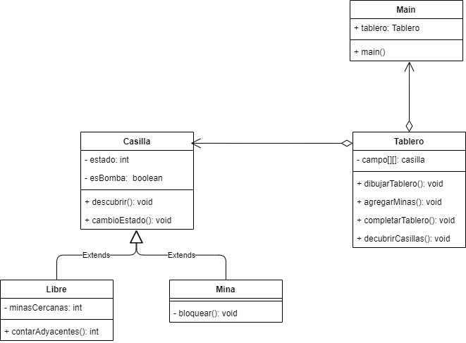

# Buscaminas

Desarrollando el clasico juego de buscaminas.

## Componentes

- Programado en Java
- Patron MVC (Modelo, Vista, Controlador)
- Patron DAO
- Programación Orientada a Objetos
- Base de datos PostgreSQL
- IDE de IntelliJ IDEA
- Prototipado en figma

## UML

El diagrama de clases utilizado para este programa es el siguiente:

## Integrantes

[Sebastián Gonzalez](https://github.com/Ghostian-gif)

[Pedro Higuera](https://github.com/PedroHigueraG)
